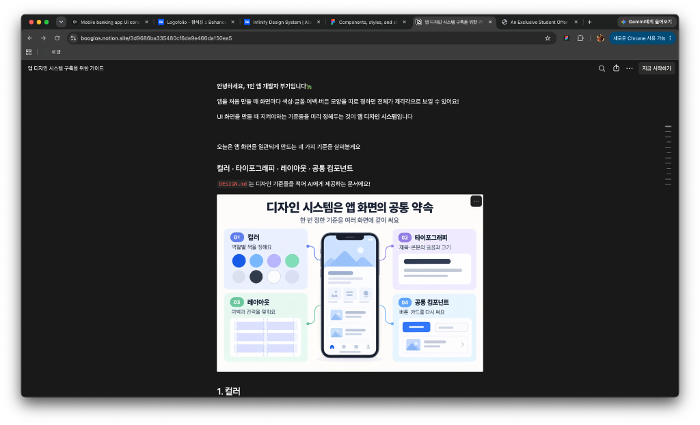
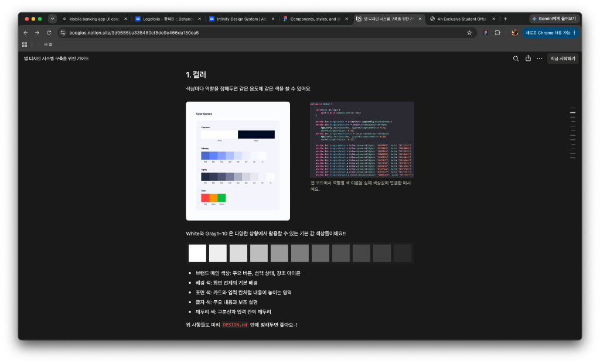
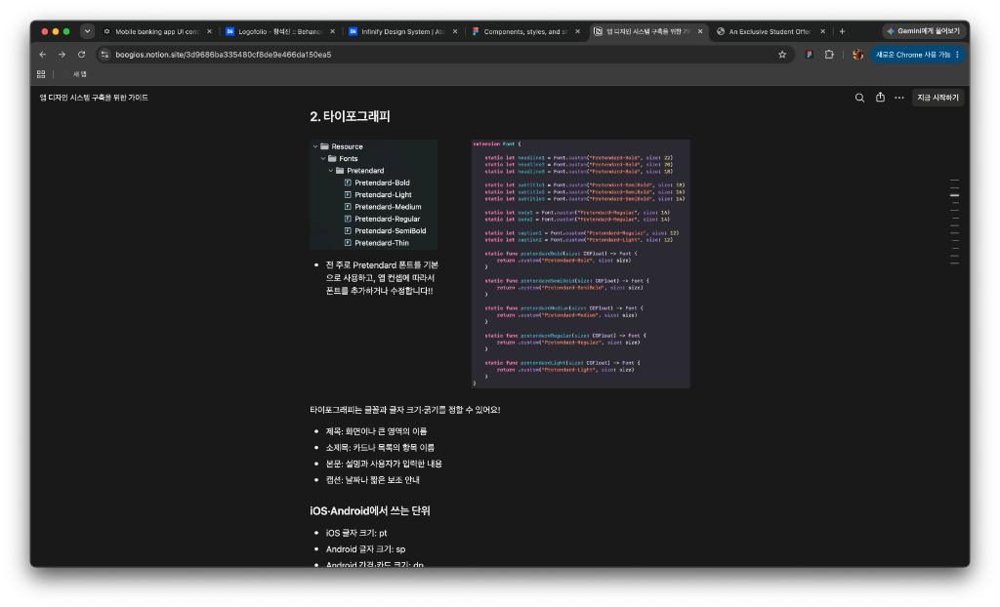
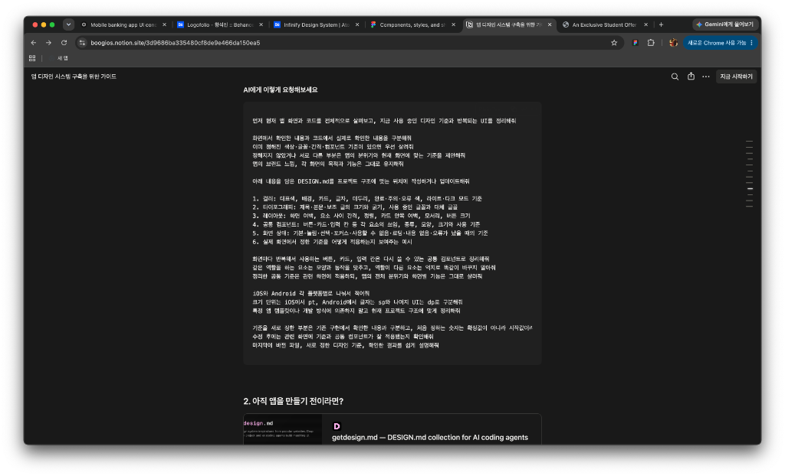
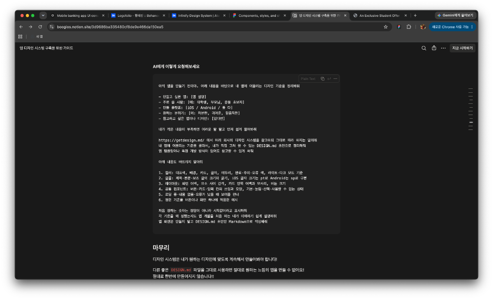

# 앱 디자인 시스템 구축을 위한 가이드

> **출처**: [부기(boogios) 노션 페이지](https://boogios.notion.site/3d9686ba335480cf8de9e466da150ea5)
> **용도**: 더코너 앱 디자인 시스템 구축 시 참고자료

---

안녕하세요, 1인 앱 개발자 부기입니다🐢

앱을 처음 만들 때 화면마다 색상·글꼴·여백·버튼 모양을 따로 정하면 전체가 제각각으로 보일 수 있어요!

UI 화면을 만들 때 지켜야하는 기준들을 미리 정해두는 것이 **앱 디자인 시스템**입니다

오늘은 앱 화면을 일관되게 만드는 네 가지 기준을 살펴볼게요

**컬러 · 타이포그래피 · 레이아웃 · 공통 컴포넌트**

`DESIGN.md`는 디자인 기준들을 적어 AI에게 제공하는 문서에요!



---

## 1. 컬러

색상마다 역할을 정해두면 같은 용도에 같은 색을 쓸 수 있어요



앱 코드에서 역할별 색 이름을 실제 색상값에 연결한 예시예요.

White와 Gray1~10 은 다양한 상황에서 활용할 수 있는 기본 값 색상들이에요!!

- **브랜드 메인 색상**: 주요 버튼, 선택 상태, 강조 아이콘
- **배경 색**: 화면 전체의 기본 배경
- **표면 색**: 카드와 입력 칸처럼 내용이 놓이는 영역
- **글자 색**: 주요 내용과 보조 설명
- **테두리 색**: 구분선과 입력 칸의 테두리

위 사항들도 미리 `DESIGN.md` 안에 정해두면 좋아요-!

---

## 2. 타이포그래피



전 주로 **Pretendard** 폰트를 기본으로 사용하고, 앱 컨셉에 따라서 폰트를 추가하거나 수정합니다!!

타이포그래피는 글꼴과 글자 크기·굵기를 정할 수 있어요!

- **제목**: 화면이나 큰 영역의 이름
- **소제목**: 카드나 목록의 항목 이름
- **본문**: 설명과 사용자가 입력한 내용
- **캡션**: 날짜나 짧은 보조 안내

### iOS·Android에서 쓰는 단위

- iOS 글자 크기: **pt**
- Android 글자 크기: **sp**
- Android 간격·카드 크기: **dp**

폰트만 바꿔도 앱의 디자인이나 분위기나 확 바뀌기 때문에 원하는 폰트를 아래 사이트에서 찾아보시는걸 추천드려요!!

👉 [눈누 (noonnu.cc)](https://noonnu.cc/)

---

## 3. 레이아웃

레이아웃은 화면의 뼈대와 요소 사이 간격을 정하는 기준이에요! 레이아웃 기준을 미리 정해두면 화면마다 여백과 카드 크기가 달라지는 경우를 줄일 수 있어요!

- 화면 가장자리의 여백을 일정하게 고정
- 관련 있는 내용은 카드나 묶음으로 모으기
- 내용이 화면보다 길어지면 스크롤할 수 있도록 하기
- 카드의 모서리와 안쪽 여백, 카드 사이 간격을 같은 기준으로 사용하기
- 실제로 누르는 영역, 터치 영역도 충분히 확보하기

### 예시

| 항목 | iOS | Android |
|------|-----|---------|
| 화면 좌우 여백 | 20pt | 20dp |
| 카드 모서리(radius) | 16pt | 16dp |
| 카드 안쪽 여백·카드 사이 간격 | 16–20pt | 16–20dp |

위 예시처럼 화면마다 항상 같은 레이아웃을 가져갈 수 있는 기준을 정하면 훨씬 더 깔끔한 화면이 됩니다!

---

## 4. 공통 컴포넌트

공통 컴포넌트는 버튼·텍스트 필드·토스트메시지·토글·바텀 시트와 같이 여러 화면에서 반복해 쓰는 것들을 말해요

예를 들어, 자주 사용하는 버튼 디자인을 한 번 정해두면 화면마다 매번 다시 만들 필요 없이 사용할 수 있어요!

이렇게 설정해두면, 나중에 디자인이 바뀌더라도 모든 화면에서 다 같이 바뀌기 때문에 여러 곳에서 사용하는 것들이 있다면 컴포넌트로 빼놓는걸 추천해요!!

- 주요·보조 버튼
- 카드 뷰
- 텍스트 필드
- 뒤로 가기 버튼
- 화면 이동 버튼
- 토글 (켜기·끄기 스위치)
- 토스트메시지 (저장이 완료되었습니다 와 같은 짧은 안내 멘트)
- 로딩 화면·빈 화면·오류 안내 팝업

위와 같은 요소들 중 여러 곳에서 반복해서 사용 중이라면 재사용할 수 있도록 정리해보세요!

---

## 나만의 디자인 시스템 구축하기

### 1. 이미 구현되어 있는 앱이 있다면?

먼저 AI에게 앱 화면을 살펴보고 반복해서 쓰는 버튼·카드·텍스트 필드 등을 찾아달라고 해보세요

같은 역할의 UI는 모양과 동작을 통일해 여러 화면에서 재사용할 수 있도록 정리하면 됩니다



#### AI에게 이렇게 요청해보세요

```
먼저 현재 앱 화면과 코드를 전체적으로 살펴보고, 지금 사용 중인 디자인 기준과 반복되는 UI를 정리해줘

화면에서 확인한 내용과 코드에서 실제로 확인한 내용을 구분해줘
이미 정해진 색상·글꼴·간격·컴포넌트 기준이 있으면 우선 살려줘
정해지지 않았거나 서로 다른 부분은 앱의 분위기와 현재 화면에 맞는 기준을 제안해줘
앱의 브랜드 느낌, 각 화면의 목적과 기능은 그대로 유지해줘

아래 내용을 담은 DESIGN.md를 프로젝트 구조에 맞는 위치에 작성하거나 업데이트해줘
1. 컬러: 대표색, 배경, 카드, 글자, 테두리, 완료·주의·오류 색, 라이트·다크 모드 기준
2. 타이포그래피: 제목·본문·보조 글의 크기와 굵기, 사용 중인 글꼴과 대체 글꼴
3. 레이아웃: 화면 여백, 요소 사이 간격, 정렬, 카드 안쪽 여백, 모서리, 버튼 크기
4. 공통 컴포넌트: 버튼·카드·입력 칸 등 각 요소의 쓰임, 종류, 모양, 크기와 사용 기준
5. 화면 상태: 기본·눌림·선택·포커스·사용할 수 없음·로딩·내용 없음·오류가 났을 때의 기준
6. 실제 화면에서 정한 기준을 어떻게 적용하는지 보여주는 예시

화면마다 반복해서 사용하는 버튼, 카드, 입력 칸은 다시 쓸 수 있는 공통 컴포넌트로 정리해줘
같은 역할을 하는 요소는 모양과 동작을 맞추고, 역할이 다른 요소는 억지로 똑같이 바꾸지 말아줘
정리한 공통 기준은 관련 화면에 적용하되, 앱의 전체 분위기와 화면별 기능은 그대로 살려줘

iOS와 Android 각 플랫폼별로 나눠서 적어줘
크기 단위는 iOS에서 pt, Android에서 글자는 sp와 나머지 UI는 dp로 구분해줘
특정 앱 템플릿이나 개발 방식에 의존하지 말고 현재 프로젝트 구조에 맞게 정리해줘

기준을 새로 정한 부분은 기존 구현에서 확인한 내용과 구분하고,
처음 정하는 숫자는 확정값이 아니라 시작값이라고 표시해줘

수정 후에는 관련 화면에 기준과 공통 컴포넌트가 잘 적용됐는지 확인해줘
마지막에 바뀐 파일, 새로 정한 디자인 기준, 확인한 결과를 쉽게 설명해줘
```

---

### 2. 아직 앱을 만들기 전이라면?

👉 [getdesign.md — DESIGN.md collection for AI coding agents](https://getdesign.md/)

위 사이트에서 다른 회사의 디자인 시스템 중 원하는 회사의 DESIGN.md파일을 참고해서 기준을 만들어달라고 요청해보세요



#### AI에게 이렇게 요청해보세요

```
아직 앱을 만들기 전이야. 아래 내용을 바탕으로 내 앱에 어울리는 디자인 기준을 정리해줘

- 만들고 싶은 앱: [앱 설명]
- 주로 쓸 사람: [예: 대학생, 부모님, 운동 초보자]
- 만들 플랫폼: [iOS / Android / 둘 다]
- 원하는 분위기: [예: 차분한, 귀여운, 믿음직한]
- 참고하고 싶은 앱이나 디자인: [있다면]

내가 적은 내용이 부족하면 어려운 말 말고 먼저 쉽게 물어봐줘

https://getdesign.md/ 에서 여러 회사의 디자인 시스템을 참고하되 그대로 따라 하지는 말아줘
내 앱에 어울리는 기준을 골라서, 내가 직접 고쳐 쓸 수 있는 DESIGN.md 초안으로 정리해줘
앱 템플릿이나 특정 개발 방식이 없어도 참고할 수 있게 써줘

아래 내용도 빠뜨리지 말아줘
1. 컬러: 대표색, 배경, 카드, 글자, 테두리, 완료·주의·오류 색, 라이트·다크 모드 기준
2. 글꼴: 제목·본문·보조 글의 크기와 굵기, iOS 글자 크기는 pt로 Android는 sp로 구분
3. 레이아웃: 화면 여백, 요소 사이 간격, 카드 안쪽 여백과 모서리, 버튼 크기
4. 공통 컴포넌트: 버튼·카드·입력 칸의 쓰임과 모양, 기본·눌림·선택·사용할 수 없는 상태
5. 로딩 중·내용 없음·오류가 났을 때 보여줄 안내
6. 정한 기준을 버튼이나 화면 하나에 적용한 예시

처음 정하는 숫자는 정답이 아니라 시작값이라고 표시해줘
각 기준을 왜 정했는지도 앱 개발을 처음 하는 내가 이해하기 쉽게 설명해줘

앱 화면은 만들지 말고 DESIGN.md 초안만 Markdown으로 작성해줘
```

---

## 마무리

디자인 시스템은 내가 원하는 디자인에 맞도록 **계속해서 만들어봐야 합니다!**

다른 좋은 `DESIGN.md` 파일을 그대로 사용하면 **절대로 원하는 느낌의 앱을 만들 수 없어요!**

**절대로 한번에 만들어지지 않습니다!!**

맘에 들지 않더라도 계속해서 맘에 들지 않는 부분을 고쳐나가면서 나만의 디자인 시스템을 구축해보시길 바랍니다!
